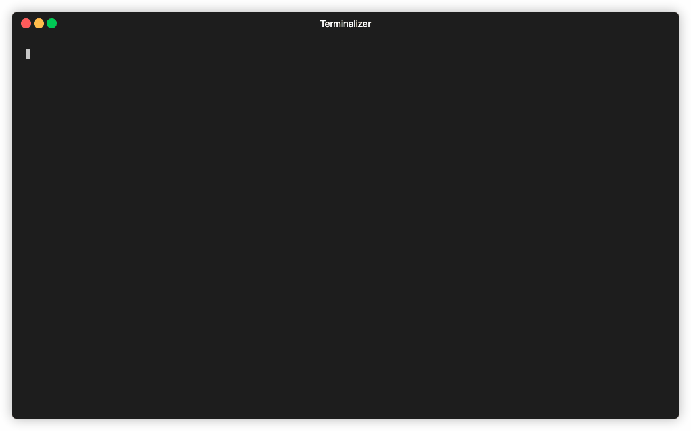

# askGPT

[](https://github.com/elulcao/askGPT/actions/workflows/go.yaml)
[](https://github.com/elulcao/askGPT/actions/workflows/codeql-analysis.yaml)

---

<p
    align="center">
    
</p>

---

`askGPT` is a Golang client for the `OpenAI` API. With `askGPT`, you can quickly and easily generate
high-quality text and more with ease. Plus, with its simple and intuitive interface, you can start
generating text in just a few lines of code.

## Installation

To install the binary for your platform, run the following command, it will be installed in your
`$GOPATH/bin` directory.

```bash
$ make install
```

## Usage

The following is a simple example of how to use `askGPT` to generate text.

```bash
$ askGPT [--config /path/to/config/file] [--endpoint endpoint --token token]
```

The config file is a YAML file that contains the following fields:

```yaml
token: "<token>"
endpoint: "<endpoint>"
```

`askGPT` creates a new text box where you can type your prompt. Once you are done, press `Enter`.
The interaction can be terminated by pressing `Esc`. The generated text will be printed to a new
text box, once you are done reading it, press `Enter` to generate more text.

Subsequent prompts will be appended to the previous prompt, so you can continue the conversation if
you want.

The conversation history is stored in a file called `.askGPT.db` in the `$HOME` directory. If you
want to clear the history, simply delete this file. The `db` file is a simple `sqlite3` database
with a single table called `responses` that contains the following fields:

```sql
id INTEGER PRIMARY KEY AUTOINCREMENT
id_gpt TEXT NOT NULL
input TEXT NOT NULL
answer TEXT NOT NULL
created_at TIMESTAMP DEFAULT CURRENT_TIMESTAMP
```

## Contributing

Pull requests are welcome. For major changes, please open an issue first to discuss what you would
like to change.

## License

This project is licensed under the [License Name] License - see the [LICENSE](LICENSE) file
for details.
